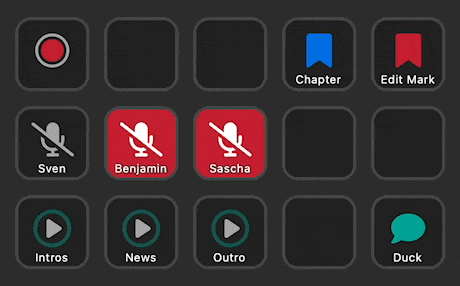

A plugin for [Elgato's Stream Deck](https://www.elgato.com/de/stream-deck-mk2), which makes recording with the awesome podcast software [Ultraschall](https://ultraschall.fm) even more fun.

# Features
In contrast to [Ultraschall's official stream deck plugin](https://github.com/Ultraschall/ultraschall-stream-deck-plugin), this one fully focuses on podcast recording and provides enhanced feedback on the stream deck like recording time and remaining time for soundboard clips.

Here is the list of actions supported, including the configuration options:

- **Record:** Start/pause recording and show recording time provided by Ultraschall 
  - Show recording time
- **Mute:** Non-destructive mute a track while recording
  - Track (1-10)
  - Mode: Toggle, push to mute or push to talk
- **Marker:** Set a marker while recording
  - Marker Type: Chapter Mark or Edit Mark
- **Soundboard:** Play a soundboard clip and see remaining time
  - Player: The player to trigger (1-99)
  - Button Action when stopped: Play or Fade in
  - Button Action while playing: Stop or Fade out
- **Duck Soundboard:** Reduce soundboard volume to level configured in the soundboard, to talk over
  - Mode: Toggle or Push to duck

> **Note**
> The soundboard does not support pausing a player and resuming a paused or faded-out player due to [this bug](https://github.com/Ultraschall/ultraschall-soundboard/issues/45) in the soundboard.

# Setup
See the [Setup](SETUP.md) documentation to learn, how to connect the plugin to Ultraschall.

# Technical Stuff
Here some technical information for you, if you are a developer.

## Stream Deck API
To make the feedback stuff like recording time, remaining soundboard time possible, this plugin uses OSC for communication with Reaper and Ultraschall. To make OSC communication work, we cannot use the standard stream deck JavaScript API, because the plugin would run in a browser environment which would not allow us to establish UDP connections.

Thus, this plugin is running on nodeJS which is _not_ among the languages/platforms propagated by the [stream deck SDK](https://developer.elgato.com/documentation/https://developer.elgato.com/documentation/). So a lot of the work which ran into this plugin was investigation for how to setup a nodeJS-based plugin and for configuring webpack to generate the plugin and the property inspector.

## npm Commands
This project uses webpack to build the plugin and the property inspector for the Stream Deck. The following npm commands are available:

- `npm run build`: Creates a development build.
- `npm run watch`: Same as `build`, but updates the bundled files when you make changes to the code.
- `npm run release`: Creates a release build.

## Development and Debugging
The [Stream Deck developer documentation](https://developer.elgato.com/documentation/stream-deck/sdk/create-your-own-plugin/) desribes where you need to put your plugin folder, so that it's recognized by the Stream Deck software. On macOS I've used symbolic links (`ln -s`) to create a link inside streamdeck's plugin folder to the output folder under `dist`.

The above mentioned document also describes how to debug the property inspector using Chrome (spoiler: open http://localhost:23654/ in Chrome). To debug the plugin open the startup script (`assets/mac/streamdeck-ultraschall.sh` or `assets\win\streamdeck-ultraschall-cmd`) and add the `--inspect` argument to the `node`-call. Then you can connect your debugger after the plugin started. Alternatively you can use the `--inspect-brk` argument which will make the node process pause right on startup until a debugger connects – useful for debugging startup issues.

## OSC Reference
Here are some hints for OSC references:

- You can find the available OSC commands of Reaper in a file. You can open this file here: **Reaper** › **Settings** › **Control/OSC/web** › _your OSC configuration_ › **Pattern config** › **(open config directory)** › `Default.ReaperOSC`
- To execute Ultraschall actions like non-destructive mute or chapter marks it's important to know, that you can trigger each action available in Reaper via OSC using the OSC path `/action/<command name>`. You can see the names of all available commands in Reaper under **Actions** › **Show action list…**. Look out for the **Command ID** column on the right: All Ultraschall commands are starting with the prefix `_Ultraschall`.
- You can find a reference of all OSC commands supported by the Ultraschall soundboard [here](https://github.com/Ultraschall/ultraschall-soundboard/blob/main/docs/OSC.md)